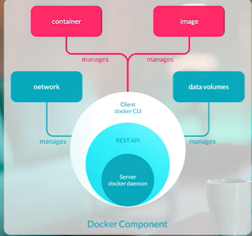
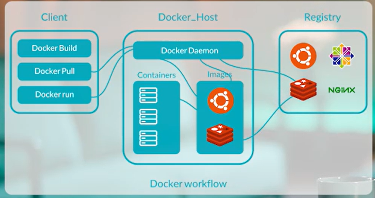
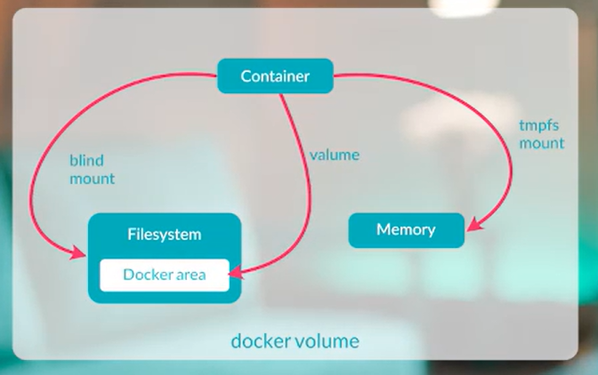
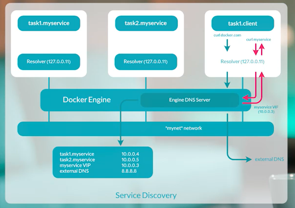

# Docker: A Practical Guide

This guide provides a practical overview of essential Docker commands and concepts, designed to get you up and running with containerization. We will cover the high-level architecture, the development workflow, and the core concepts of volumes, networking, and container management.

## How Docker Works: The Big Picture

At its core, Docker operates on a client-server architecture. The **Docker Client** (the `docker` command you type) communicates with the **Docker Daemon** (or engine), which does the heavy lifting of building, running, and managing your containers. The daemon can pull images from a **Registry** (like Docker Hub) to create containers.



## The Docker Workflow

The typical development workflow follows a simple, repeatable pattern: you define your application environment in a `Dockerfile`, build that into a read-only `Image`, and then run one or more instances of that image as a `Container`.



## 1. Key Concepts: Volumes & Networking

To run applications effectively, you need to manage persistent data and communication.

### Docker Volumes

Containers are ephemeral, meaning any data written inside a container is lost when the container is removed. To persist data, we use **volumes**, which are Docker-managed directories on the host machine that are mounted into a container. This is essential for databases, user uploads, or any stateful application.



**Example: Creating and using a volume**

```bash
# Create a dedicated volume to store MySQL data
docker volume create mysql-data

# Run a MySQL container and mount the volume to the directory where MySQL stores its data
docker run -d \
  --name my-database \
  -e MYSQL_ROOT_PASSWORD=mysecretpassword \
  -v mysql-data:/var/lib/mysql \
  mysql:8.0
```
In this example, all database files will be saved in the `mysql-data` volume on the host.

### Docker Networking

Docker containers need to communicate with each other and the outside world. This is handled by Docker's networking system, which uses network drivers. While several drivers exist (`host`, `none`, `overlay`), the most common is `bridge`.

For robust communication between containers using their names, it is **best practice to create your own custom bridge network.** Containers on the same custom network can resolve each other by name automatically.



**Example: Creating a network for two containers**

1.  **Create a new bridge network:**
    ```bash
    docker network create my-app-network
    ```

2.  **Run two containers on this network:**
    ```bash
    docker run -dit --name container-foo --network my-app-network busybox
    docker run -dit --name container-bar --network my-app-network busybox
    ```

3.  **Test communication using container names:**
    You can now `ping` one container from the other using its name, thanks to Docker's built-in DNS.
    ```bash
    docker exec container-foo ping container-bar

    # PING container-bar (172.19.0.3): 56 data bytes
    # 64 bytes from 172.19.0.3: seq=0 ttl=64 time=0.082 ms
    ```

## 2. Managing and Interacting with Containers

Here are the essential commands for the container lifecycle.

### Running a Container: `docker run`

This is the primary command for creating and starting a new container from an image.

**Key Flags:**
*   `--name <name>`: Assign a memorable name to your container.
*   `-d`: Detached mode (runs in the background).
*   `-p <host_port>:<container_port>`: Publish a port to the host.
*   `-e <KEY>=<VALUE>`: Set an environment variable.
*   `-v <volume>:<path>`: Mount a volume.
*   `--rm`: Automatically remove the container when it exits.
*   `--network <name>`: Connect the container to a specific network.

**Example:**
```bash
docker run -d \
  --name my-web-server \
  --network my-app-network \
  -p 8080:80 \
  nginx
```

### Viewing Container Logs: `docker logs`

Essential for debugging, this command fetches the logs of a container.

```bash
# View all current logs for the mysql container
docker logs my-database

# Follow the logs in real-time (like 'tail -f')
docker logs -f my-database
```

### Executing a Command in a Running Container: `docker exec`

This command allows you to run a command, like an interactive shell, inside an already running container.

*   `-i` (interactive): Keep STDIN open.
*   `-t` (tty): Allocate a pseudo-TTY for an interactive shell.

**Example: Interactive Shell in a MySQL Container**

1.  **Get a bash shell inside the container:**
    ```bash
    docker exec -it my-database bash
    ```

2.  **Interact with the MySQL service (from *inside* the container):**
    ```bash
    mysql -u root -p
    ```
    Enter the password `mysecretpassword` when prompted.

3.  **Run SQL commands:**
    ```sql
    CREATE DATABASE devops_db;
    SHOW DATABASES;
    EXIT;
    ```

4.  **Exit the container's shell** by typing `exit`.

### Copying Files: `docker cp`

You can transfer files between your host machine and a container.

**Example: Copying a file *into* a container**
```bash
# Create a sample file on your host
echo "My config data" > config.txt

# Copy config.txt into the /tmp directory of the 'my-web-server' container
docker container cp config.txt my-web-server:/tmp/

# Verify the file was copied
docker exec my-web-server ls /tmp
```

## 3. Inspecting and Cleaning Up

### Getting Detailed Information: `docker inspect`

This command returns detailed, low-level information about any Docker object (container, image, network, etc.) in JSON format.

```bash
# Get all information about the 'my-web-server' container
docker container inspect my-web-server
```

### Cleaning Up Your System: `docker system prune`

Docker can accumulate many unused objects. `docker system prune` is a convenient way to clean them up.

```bash
# This will remove all stopped containers, dangling images, and unused networks.
docker system prune -f

# WARNING: To also remove unused volumes (which can cause data loss), add the --volumes flag.
docker system prune -f --volumes
```